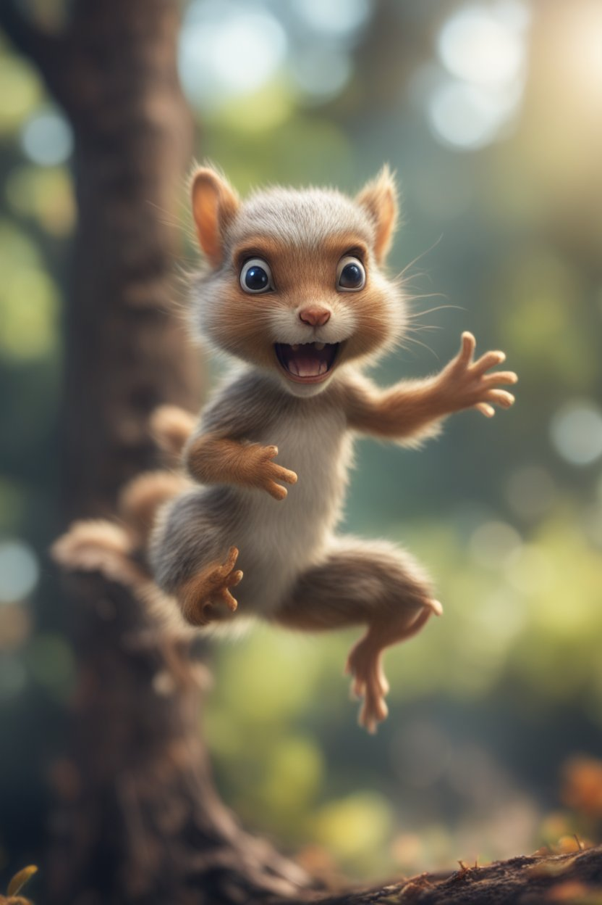

Just run this, or open and copy this into you python editor:
https://raw.githubusercontent.com/dirtyfish/pythonvideobychatgpt/main/myvid.py

Link to output:
https://vimeo.com/907254695?share=copy

A few cosmetic changes was done after initial output from the prompt.

And here is the squirrel: 

